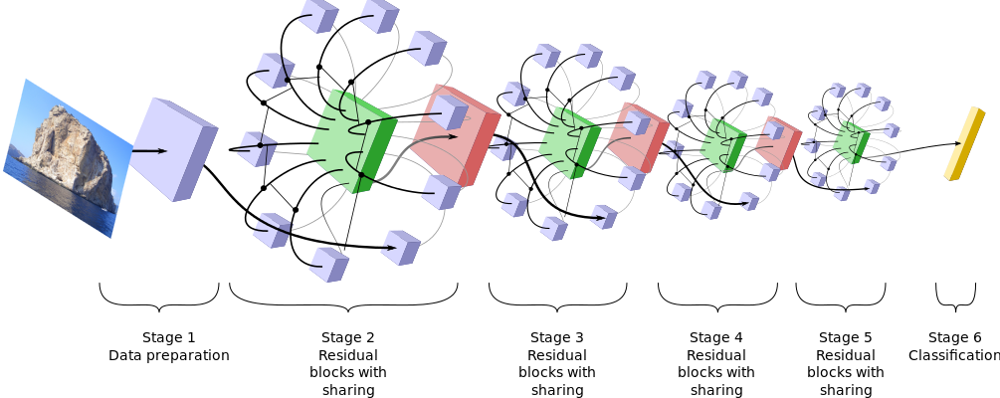

# ShaResNet
Reducing residual network parameter number by sharing weights

# Paper

#### Project

This work is part of the DeLTA ([delta-onera.github.io](delta-onera.github.io)) project at [ONERA](www.onera.fr).
This projects aims at developing innovative machine learning approaches for aerospace applications.

## Architecture

The ShaResNets are residual networks sharing convolution involved in spatial connections.
At a given stage the weights are the same for all 3x3 convolutions.
The result is a lighter model (between 20% and 45% less parameters).
Quantitative figures are given in the result section.

## Results

Table of parameter number reduction using ShaResNets compared to the original ResNet.
WRN stands for Wide Residual Networks (BMVC 2016,
http://arxiv.org/abs/1605.07146 by Sergey Zagoruyko and Nikos Komodakis).

| Dataset | Model | Param. Orig. | Param. Share. | Param dec. |
| ------- | ----- | ---------- | ---------- | --------- |
| CIFAR 10 | ResNet-164  | 1.70 M | 0.93 M | 45% |
|          | WRN-40-4    | 8.95 M | 5.85 M | 35% |
|CIFAR 100 | WRN-28-10   | 36.54 M | 26.86 M | 26% |
|IMAGENET  | ResNet-34   | 21.8 M | 13.6 M | 37% |
|          | ResNet-50   | 25.6 M | 20.5 M | 20% |
|          | ResNet-101  | 44.5 M | 29.4 M | 33% |
|          | ResNet-152  | 60.2 M | 36.8 M | 39% |

Table of accuracies on CIFAR 10 and 100 and ImageNet ILSVRC 2012 (validation set).

|Dataset | Model | Err. top 1 Orig. | Err. top 1 Share.  | Err. top 5 Orig.| Err. top 5 Share|
| --- | --- | --- | --- | --- | --- |
|CIFAR 10 |ResNet-164  | 5.46 %   |  6.2 %  | | |
|         |WRN-40-4    | 4.17 %  |  5.1  % | | |
|CIFAR 100|WRN-28-10   | 20   %   |  20.2 %  | | |
|IMAGENET |ResNet-34   | 26.73 %   |  28.25 % |  8.74 %  | 9.42 %   |
|         |ResNet-50   | 24.01 %   |  24.61 % |  7.02 %  |  7.41 %  |
|         |ResNet-101  | 22.44 %  |  22.91 % |  6.21 %  |  6.55 %  |
|         |ResNet-152  | 22.16 %  |  22.23 % |  6.16 %  |  6.14 %  |

## Code

The experiments uses Torch7 with neural network package.
We provide in this repository the model definition.
The weights will soon be available to download.

#### CIFAR

The model for CIFAR 10 and 100 have been trained using the original implementation of Wide Residual Networks at [github.com/szagoruyko/wide-residual- networks](github.com/szagoruyko/wide-residual-networks}).

#### ImageNet

The provided model for imagenet is to be trained using the code from Facebook at  [github.com/facebook/fb.resnet.torch](github.com/facebook/fb.resnet.torch).
